# Random Numbers & Conditional Logic

Review:  Discuss the program flow of execution when:

1. val = 2
2. val = 0

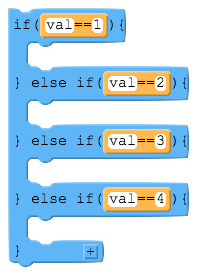


Just like an if statement without an else is skipped over if the condition is false, an if-else-if without a final else clause is skipped over entirely if none of the conditions is true.
  
Here is a generic example - forgetting what the code inside the if statements is supposed to do, just consider the if-else-if structure here.

What happens if val is 0? (or anything that's not 1, 2, 3, or 4?)

Answer: nothing. If val is 0 then each of the conditions will be checked in order, and since none of them is true, nothing will be executed.

This might seem obvious here, but the most common way this happens is that in your program you think that val can only be 1, 2, 3, or 4, but something happens to make it be some other value you weren't expecting. It's particularly hard to catch because there are no syntax errors here, nothing will crash due to an illegal operation. It will fail silently.

A way to protect yourself is to add a final else clause - even if you think it can't be reached - that prints a statement to yourself like "uh oh!".


## Random Numbers

Many applications make use of random numbers:
- An attack in a game does a random amount of damage between 20-30.
- A pokeball contains a random pokemon
- A rock-paper-scissors application against a computer

A `library` in JavaScript is a collection of functions and values that you don't have to program yourself and are free to use. Many libraries must be imported.

> Example. The toLowerCase() function that turns all strings letters to lower case is part of a built-in JavaScript library. You don't have to code it yourself, but can (and have) used it in your programs.

The `Math` library is a built-in library containing many such functions/values. Examples:
- Math.pow(4,2) returns 4 to the power of 2, or 16
- Math.PI returns PI to a high degree of accuracy (much better than just 3.14)
- Math.random() returns a random number between 0 and 0.9999...

> Example. Declare variable x, y and z to be a random number. Then output each value. Run this program multiple times and observe the output
```
let x =
let y =
let z = 
console.log(x);
console.log(y);
console.log(z);
```

Sometimes you want to make random numbers higher than 1. To do this, simply multiply the value by the highest value your random number could be.

If you want a whole number use Math.round or Math.floor.

> Example. Create a random decimal number between 0 and 100.


> Example. Create a random integer between 0 and 10 (not including 10)


Now what if you wanted a random number between -5 and +5? The formula for this is:
>Math.random() * *RANGE* + *LOW #*

>Example. Create a random number between -5 and 5.

>You Try. Write an application that prompts the user for a low number and a high number. Then display a random integer between those 2 values. 


## Introduction to Conditionals

Watch: https://youtu.be/kyFdniI-ZZs

Points to pay attention to:
- The "Boolean operators" are AND and OR.
- In JavaScript you write them as && for AND and || for OR.
- You use them to combine boolean expressions into a single statement when you need to check multiple conditions before executing a particular segment of code.

### Boolean operators && and || and !

The logical operators -- also known as the Boolean Operators -- AND (&&), OR (||) and NOT (!) allow you to compare the results of more than one Boolean operation at a time.

NOTE: the OR is made with two vertical "pipe" characters. The "pipe" is on the keyboard with same button as \ -- it's right next to the key with }] on it, just above the Return/enter key.


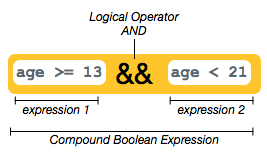

The && operator (called "AND") lets you check whether two conditions are both true at the same time. Consider the statement below:

>This says: "True or false: is it the case that BOTH age >= 13 AND age < 21?"


- If both of expression 1 and expression 2 return true then the larger compound boolean expression returns true. 
- You can replace expression 1 and expression 2 in that statement with anything that evaluates to true/false.
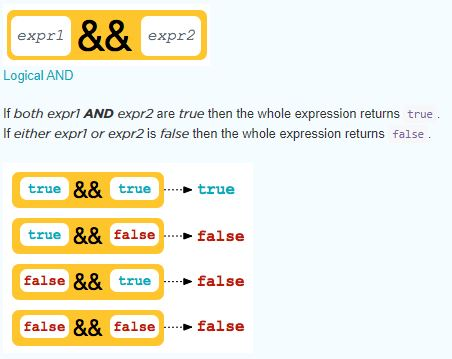
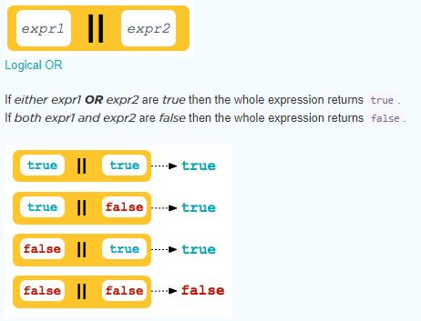
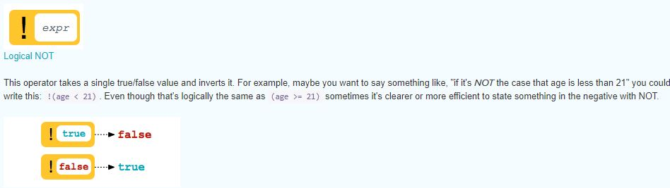

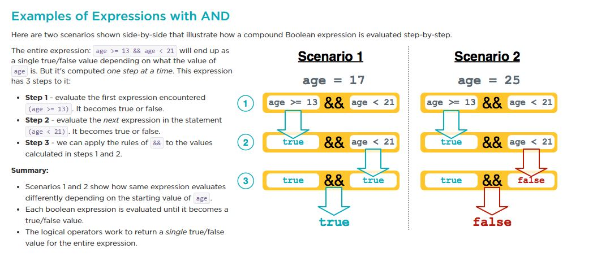
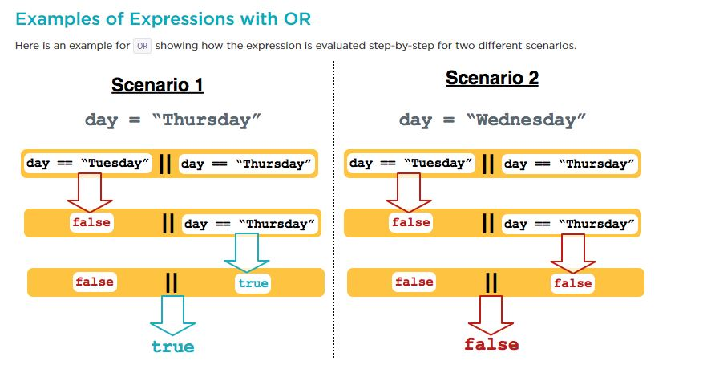

### Syntax Problems

It's common to forget that you need to state a full Boolean expression on each side of the logical operator. This happens because of the way we state conditions in English. For example in speaking English you might say:

>"If the day is Saturday or Sunday"

And then write this:

```
day == "Saturday" || "Sunday"
```

This is incorrect because "Sunday" by itself is not a boolean expression - it isn't true or false. So the correct version is a bit more verbose but one the computer can process:

```
day == "Saturday" || day == "Sunday"
```

>Just remember that each side of a boolean operator needs to evaluate to true or false.


### Logic Problems

There are logical misconceptions because the way we use "and" and "or" when speaking in English which is sometimes ambiguous. 
  
Take these two statements which if you heard them in regular English mean the same thing:

>"Patrons under the age of 12 and over the age of 65 get a discount"

>"Patrons who are under 12 or over 65 get a discount"

>One statement uses and and the other one or. If you're writing code, which should it be? Does it matter? It turns out: yes.

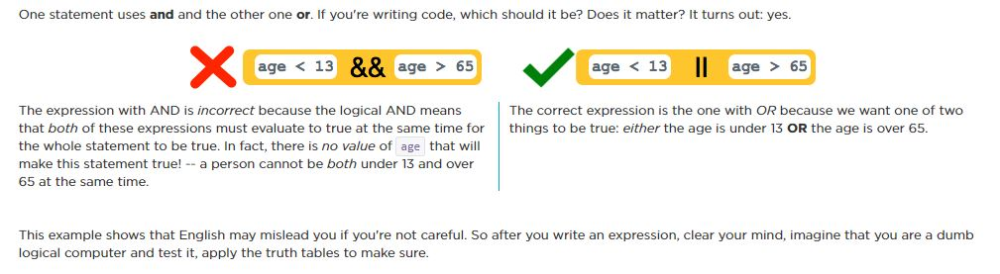


### Using an if statement

Since compound boolean expressions eventually evaluate down to a single true/false value you can use them in an if statement. The whole expression evaluates to determine whether or not execute a section of code. Here is a simple example:

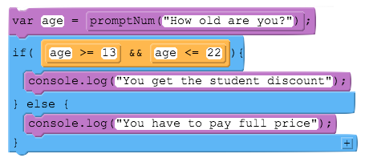


### How Compound Boolean Expressions Work:

You learned before that for the Boolean operators &&, ||, and ! that you can plug in any expression that evaluates to true or false on either side of the operator.
  
Of course, since compound boolean expressions evaluate to true or false, you can also use compound boolean expressions within other compound boolean expressions to make an even more sophisticated statement.
  
In fact, there is no limit to how many boolean expressions you can embed within a single statement.
  
To prove the point, here's a completely made up long compound boolean expression with eight different other expressions. 
```
  (( expr1 || expr2 && expr3) && expr4) && (expr5 && expr6 || (expr7 || expr8))
```

Now this is probably not a useful expression, but the point is that it could be evaluated assuming that expr1 through expr8 are Booleans.

#### A worked example:

Let's look an example similar to the one in the video, and we'll breakdown process the computer goes through to evaluate this long expression step-by-step. In English what we're trying to express is:
  
  >"If it's a Tuesday or a Thursday, or the person is between the ages of 13 and 21 (including 13 but not 21), then they should get a discount."
  Here is the entire compound boolean expression in an if-statement:


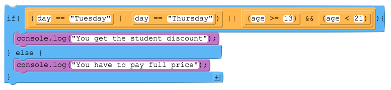

  The scenario presented below shows how the expression is evaluated step-by-step to arrive at a single false at the very end. This particular scenario requires seven computations of Boolean expressions to whittle it down to the final single value.

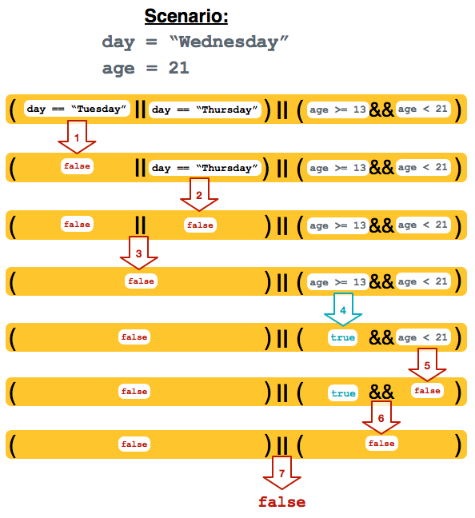


> Example. Create a Delivery application that prompts the user for the length, width, and height of a package, and then
displays “Reject” if any dimension is greater than 10, and “Accept” if all the dimensions are less than or
equal to 10.

> Example. Create a Valid Grade application that asks the user to enter a final grade for an English class. Output "Grade Submitted" if it is between 0 and 100 and "Grades must be between 0 and 100" otherwise.


> Example. Open the Map Analyzer and solve maps 1-3.
> https://replit.com/@jessebacque_/map-analyzer-start
